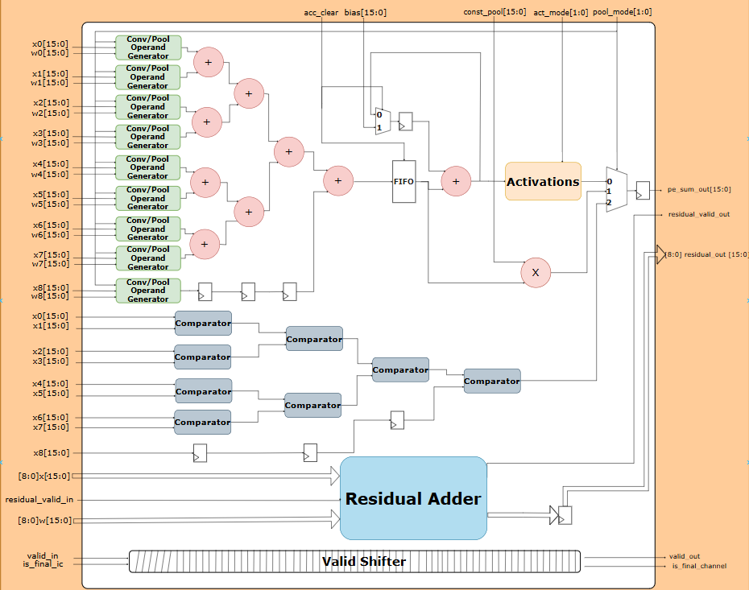
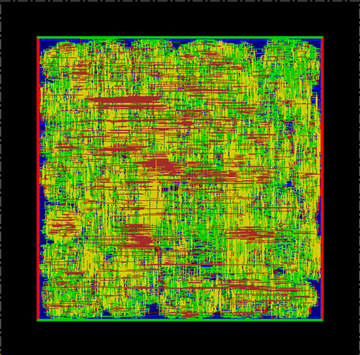

# Custom FP16 Processing Element (PE) for CNN Acceleration

## 1. Overview
Design and physical implementation of a high-speed, deeply pipelined **16-bit Floating-Point (FP16) Processing Element (`ei_pe`)** for Convolutional Neural Networks (CNN) acceleration. This project covers the complete **45nm RTL-to-GDSII ASIC flow**, including RTL Architecture with Register Retiming, Logic Synthesis, Tcl-automated Place & Route (PnR), Multi-Mode Multi-Corner (MMMC/OCV) Static Timing Analysis, and Physical/Formal Sign-off Verification.

---

## 2. Hardware Architecture & Key Modules
The Processing Element (`ei_pe`) is the core computation engine tailored for accelerating **2D Convolution (3x3)**, **Pooling (Max/Average)**, and **Residual/Shortcut** operations in Deep Neural Networks (DNNs). It processes 9 parallel data streams corresponding to a 3x3 spatial window with **IEEE-754 half-precision floating-point (FP16)** precision.

### Core Hardware Sub-modules:
* **Conv/Pool Operand Generator Array (x9):** 9 parallel FP16 computation units (`mul0`...`mul8` & `pool_mul`) processing input feature map pairs (`x0`...`x8`) and kernel weights (`w0`...`w8`) for 16-bit Multiply-Accumulate (MAC) or Pooling modes.
* **Retimed & Pipelined Adder Tree:** A 4-level spatial binary FP16 adder tree (`u_add_l1` to `u_add_l4_final`) optimized with **20-stage register retiming (`retime_s1`...`retime_s20`)** to compress critical path depth to 19 logic levels and boost maximum operating frequency (Fmax) by **2.91x**.
* **Max-Pooling Comparator Tree:** A dedicated parallel 2-input FP16 comparator tree (`u_max_pooling_g0`...`g7`) designed for low-latency spatial Max Pooling extraction.
* **Accumulator & Bias Unit:** Integrates a FIFO buffer and FP16 bias adder (`bias[15:0]`) to accumulate intermediate spatial sums across multiple input channels until triggered by `is_final_ic` and `acc_clear`.
* **Configurable Activation & Output MUX:**
  * *Activation:* Applies hardware non-linear activation functions controlled by `act_mode[1:0]`.
  * *Output Selection:* Driven by `pool_mode[1:0]` to route between Convolution, Max Pooling, or Average/Constant Pooling outputs (`pe_sum_out[15:0]`).
* **Residual Adder & Valid Pipeline Shifter:**
  * *Residual Adder (`u_residual`):* Dedicated parallel FP16 adder array for direct Shortcut/Residual connection additions (`residual_valid_in` / `residual_valid_out`).
  * *Valid Shifter:* Shift-register synchronization array aligning control signals (`valid_in`, `is_final_ic`) with the retimed datapath latency to generate cycle-accurate output flags (`valid_out`, `is_final_channel`).

---

## 3. ASIC Implementation Flow (45nm CMOS)
The design was synthesized and implemented down to a DRC-clean physical layout using the **Cadence 45nm Standard Cell Library (`gsclib045`)** and industry-standard EDA tools:
* **Logic Synthesis & Retiming:** Cadence Genus
* **Place & Route (PnR) & CTS (`CCOpt`):** Cadence Innovus
* **Static Timing & Power Sign-off:** Cadence Innovus / Voltus (`MMMC OCV` across `wc` & `bc` PVT corners)
* **Formal Verification:** Cadence Conformal LEC
* **RTL & Gate-Level Simulation (GLS):** Cadence Xcelium (`xrun`)

### Repository Structure
* `ASIC/` : Synthesis (Genus), PnR/STA Tcl scripts (Innovus), SDC constraints & Sign-off Reports
* `RTL/` : Verilog/SystemVerilog RTL source files & Testbenches
* `PE_structure.png` : Microarchitecture block diagram of the FP16 PE
* `ASIC.png` : Final Post-Route Physical Layout (Cadence Innovus)
* `README.md` : Project documentation

---

## 4. Quality of Results (QoR) & Sign-off PPA Summary
Post-Route sign-off reports confirm complete multi-corner timing closure (`FEP = 0`) and zero physical verification errors at **0.9V (`wc` slow corner)** operating voltage.

| Metric | Sign-off Result | Baseline (Pre-Retiming) | Description & Breakdown |
| :--- | :--- | :--- | :--- |
| **Target Clock Period** | **2.20 ns** | 6.40 ns | Multi-corner MMMC/OCV analysis (`wc`: 0.9V Slow, `bc`: 1.1V Fast) |
| **Max Frequency (Fmax)** | **454.55 MHz** | 156.25 MHz | **2.91x frequency speedup** achieved via register retiming & ECO sizing |
| **Setup Timing (WNS / TNS)** | **MET (+0.484 ns / 0.000 ns)** | MET (+0.003 ns) | **FEP = 0** across all path groups (`reg2reg`: +0.799 ns, `in2reg`: +1.397 ns) |
| **Hold Timing (WNS / TNS)** | **MET (+0.564 ns / 0.000 ns)** | MET | **FEP = 0** across all path groups (`reg2reg`: +0.844 ns, `in2reg`: +0.564 ns) |
| **Total Cell Area** | **103,856.17 um²** | 84,466.48 um² | **40,984 Standard Cells** implemented at **70% Core Utilization** |
| **Total Power (@ 454.55 MHz)** | **17.04 mW** | 5.19 mW (@ 156 MHz) | **Internal:** 10.44 mW (61.30%), **Switching:** 6.59 mW (38.68%), **Leakage:** 2.37 uW (0.014%) |
| **Physical Verification** | **0 DRC / 0 Connectivity** | DRC-Clean | 0 Geometry/Spacing shorts, 0 Open nets, 0 Unconnected PG pins |

> **Power & Clock Tree Analysis Note:** Operating at nearly 3x the baseline frequency (`454.55 MHz`, toggle rate `909.09 MHz` at 20% default switching activity), sequential registers account for `44.89%` (`7.65 mW`) and combinational FP16 MAC logic accounts for `38.50%` (`6.56 mW`). The synthesized clock tree (`CCOpt`) is highly optimized, consuming only **`16.62%` (`2.83 mW`)** of total power while maintaining ultra-low static leakage of **`2.37 uW`**.

---

## 5. Formal Verification (LEC)
Logic Equivalence Checking (LEC) was conducted between the golden RTL source and the post-synthesis / post-PnR gate-level netlist:
* **Verification Tool:** Cadence Conformal LEC
* **Result:** **PASS (100% Equivalent — 0 Non-equivalent points)**

---

## 6. Physical Layout (Place & Route)
The final routed layout of the `ei_pe` core generated in **Cadence Innovus** across 5 metal routing layers (`Metal1` – `Metal5`):
* **PDN & Floorplan Optimization:** Configured at **70% core density** with `Metal2/Metal3` core power rings and `Metal1` standard-cell followpins, completely eliminating lower-metal PDN-to-pin DRC shorts.
* **Timing Closure & ECO:** Closed 19-logic-level critical paths using `CCOpt` useful skew, source-latency clock tree balancing, and targeted **in-place ECO drive-strength upsizing (`XL/X1` to `X2/X4`)** without disturbing routed signal nets.

